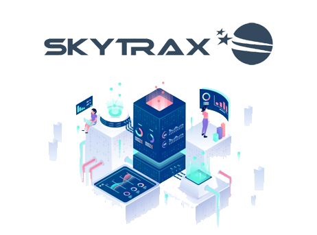
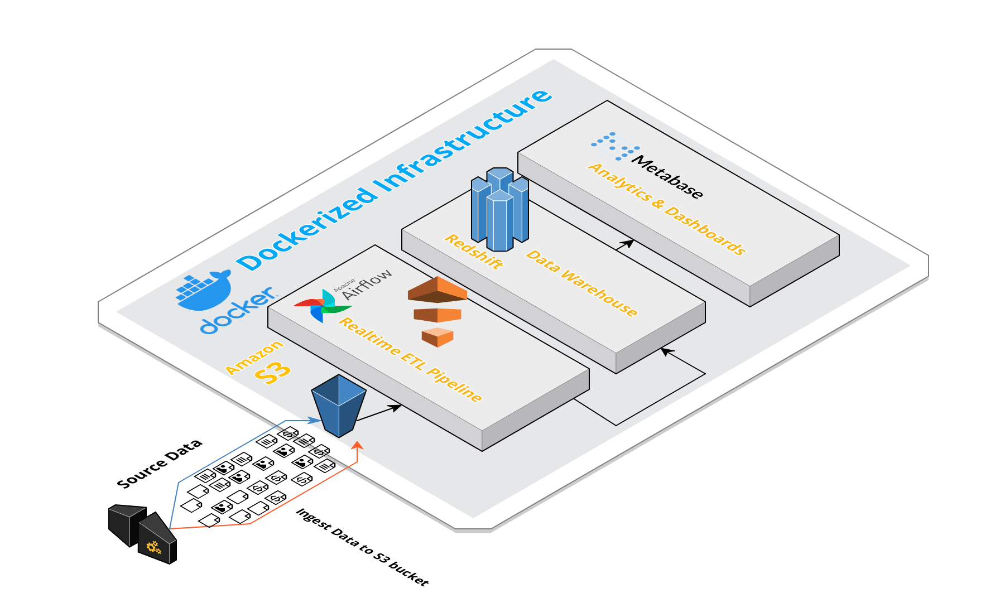
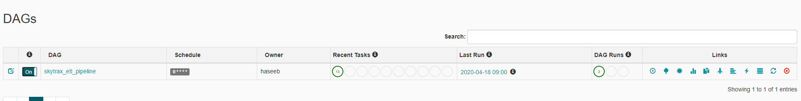
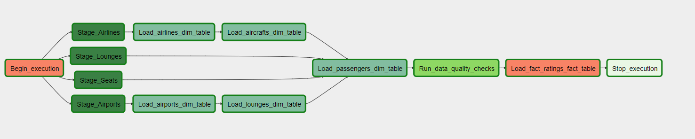
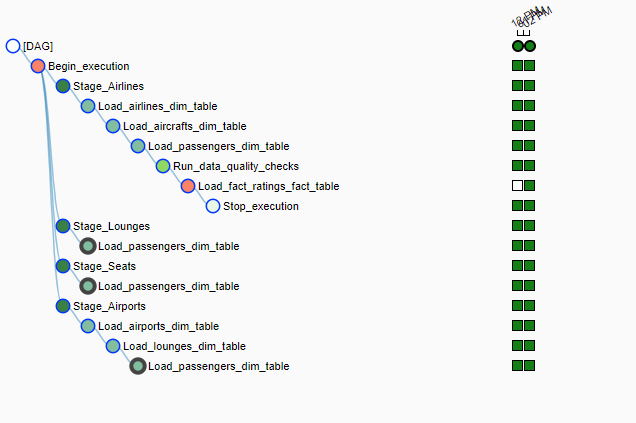
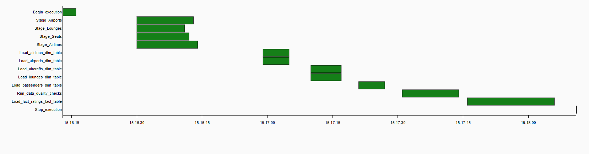
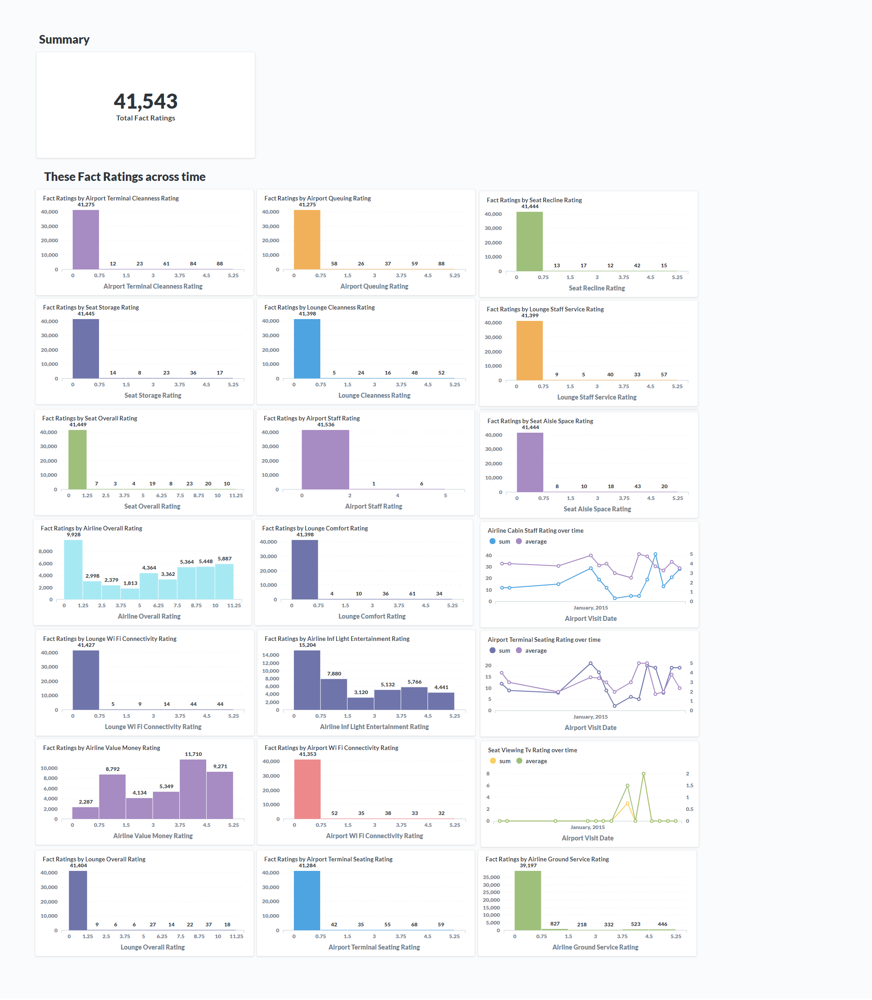
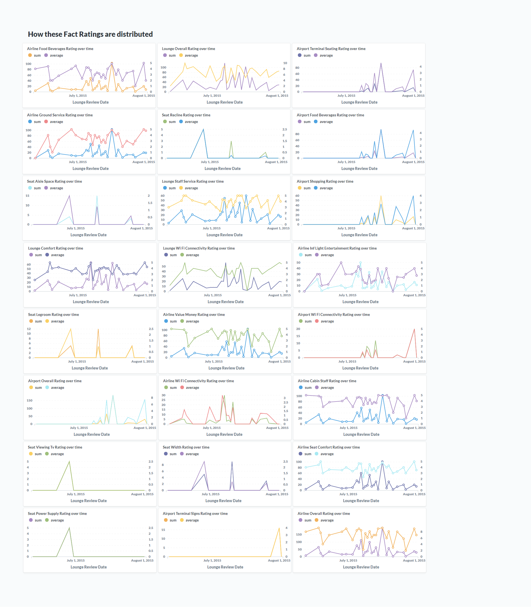

# Skytrax Data Warehouse
A full data warehouse infrastructure with ETL pipelines running inside docker on Apache Airflow for data orchestration, AWS Redshift for cloud data warehouse and Metabase to serve the needs of data visualizations such as analytical dashboards. 

## Architecture 

Data Warehouse Consists of various modules:

 - [Apache Airflow for Data Orchestration](https://airflow.apache.org/)
 - [Redshift as Cloud Warehouse](https://aws.amazon.com/redshift/)
 - [Metabase as Business Intelligence Tool](https://www.metabase.com/) 
 - [Docker to Contain Whole Infrastructure](https://www.docker.com/)

#### Overview
Data is obtained from [here](https://www.kaggle.com/austinpeck/skytrax-reviews-dataset-august-2nd-2015). The data collected is stored on local disk and is timely moved to the Landing Bucket on AWS S3. ETL jobs are written in SQL and scheduled in airflow to run every hour to keep data fresh in cloud data warehouse.  

### Data Modeling
Following are the fact and dimension tables created:

#### Dimension Table
    aircrafts
    airlines
    passengers
    airports
    lounges
    
#### Fact Tables
    fact_ratings

### ETL Flow

 - Data Collected from [here](https://www.kaggle.com/austinpeck/skytrax-reviews-dataset-august-2nd-2015) is moved to landing zone s3 buckets.
 - ETL job has s3 module which copies data from landing zone to stagging in Redshift.
 - Once the data is moved to Redshift, a task in airflow is triggered which reads the data from stagging area and apply transformation.
 - Using the Redshift staging tables and UPSERT operation is performed on the dimensional & fact Data Warehouse tables to update the data.
 - ETL job execution is completed once the Data Warehouse is updated. 
 - Airflow DAG runs the data quality check on Warehouse tables between the ETL job to ensure right data.
 - Dag execution completes once the Data Warehouse is updated.

## Environment Setup

### Hardware Used
Redshift: For Redshift I used 2 Node cluster with Instance Types `dc2.large`

### Setting Up Infrastructure

Run the following commands in terminal to setup whole infrastructure locally:
1. `git clone https://github.com/iam-mhaseeb/Skytrax-Data-Warehouse`
2.  `cd Skytrax-Data-Warehouse`
3.  Considering you have docker service installed and running run `docker-compose up`. It will take sometime to pull latest images & install everything automatically in docker.

### Setting up Redshift
You can follow the AWS [Guide](https://docs.aws.amazon.com/redshift/latest/gsg/rs-gsg-launch-sample-cluster.html) to run a Redshift cluster.

## How to run 

#### Airflow
Make sure docker containers are running. 
Open the Airflow UI by hitting http://localhost:8080 in browser and setup required connections.

You should be able to see skytrax_etl_pipeline Dag like in pictures below:

Skytrax Pipeline DAG

You can explore dag further in different views like below:

DAG View:

DAG Tree View:

DAG Gantt View: 

#### Metabase

Make sure docker containers are running. 
Open the Metabase UI by hitting http://localhost:3000 in browser & setup your metabase account and database.

You should be able to play with data after running dag successfully like I made dashboard in pictures below:

Dashboard1:

Dashboard2:

## Scenarios

-   Data increase by 100x. read > write. write > read
    
    -   Redshift: Analytical database, optimized for aggregation, also good performance for read-heavy workloads
    -   Introduce EMR cluster size to handle bigger volume of data

-   Pipelines would be run on 7am daily. how to update dashboard? would it still work?
    
    -   DAG is scheduled to run every hour and can be configured to run every morning at 7 AM if required. 
    -   Data quality operators are used at appropriate position. In case of DAG failures email triggers can be configured to let the team know about pipeline failures.
    
-   Make it available to 100+ people
    -   We can set the concurrency limit for your Amazon Redshift cluster. While the concurrency limit is 50 parallel queries for a single period of time, this is on a per cluster basis, meaning you can launch as many clusters as fit for you business.
 

## Authors

* **[Muhammad Haseeb](https://github.com/iam-mhaseeb)**

## License

This project is licensed under the MIT License - see the [LICENSE](LICENSE) file for details
